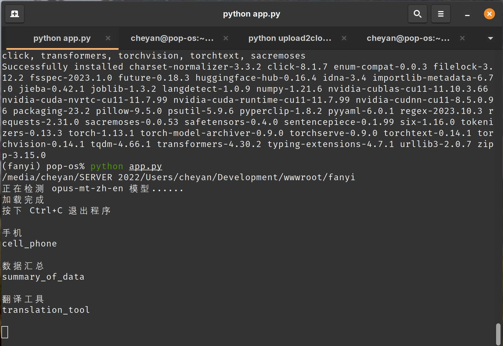

# simple_translation

一个简单的离线翻译工具，单词之间使用_相连，并会自动把结果复制到剪贴板
A simple offline translation tool that connects words with underscores and automatically copies the results to the clipboard

使用 [opus-mt-zh-en](https://huggingface.co/Helsinki-NLP/opus-mt-zh-en) 模型实现

例如：

简单翻译
simple_translation

### 配置
conda create -n fanyi python=3.7
conda activate fanyi
pip install -i https://pypi.tuna.tsinghua.edu.cn/simple -r requirements.txt

注意，如果是 WSL 下使用需要安装 `cuda-repo-wsl-ubuntu*.deb` 这个相关包

### 使用
python app.py

